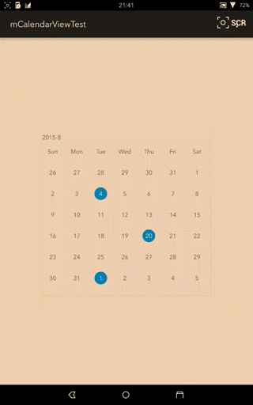
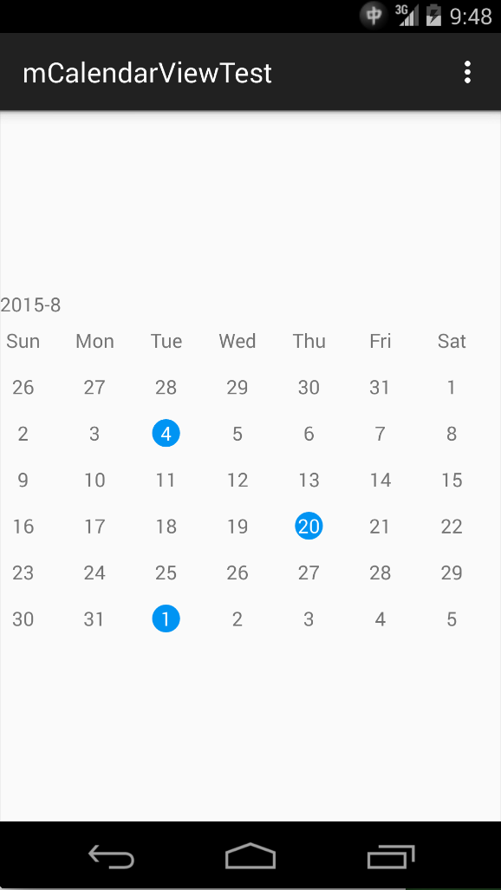
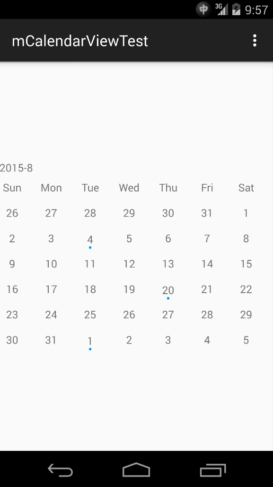
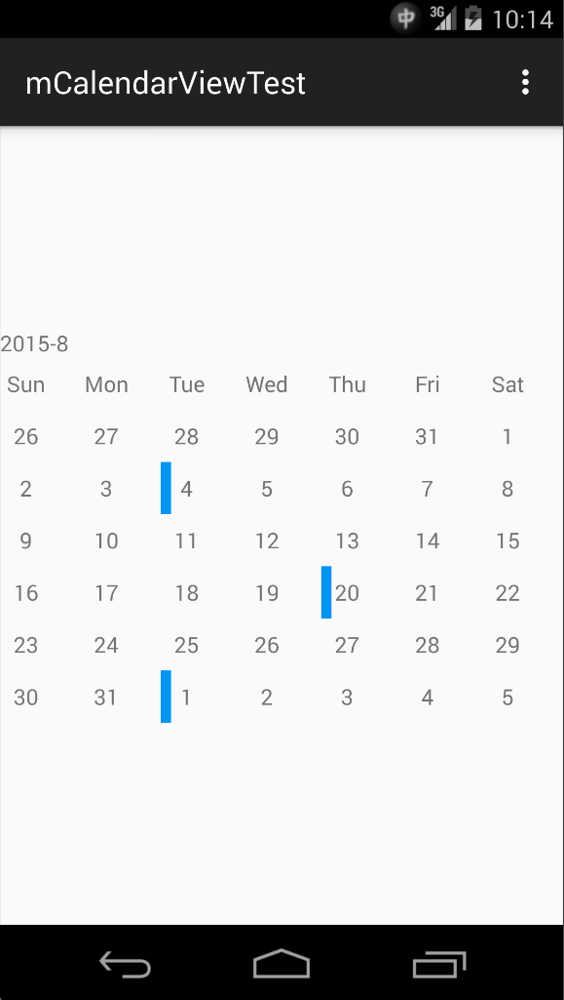
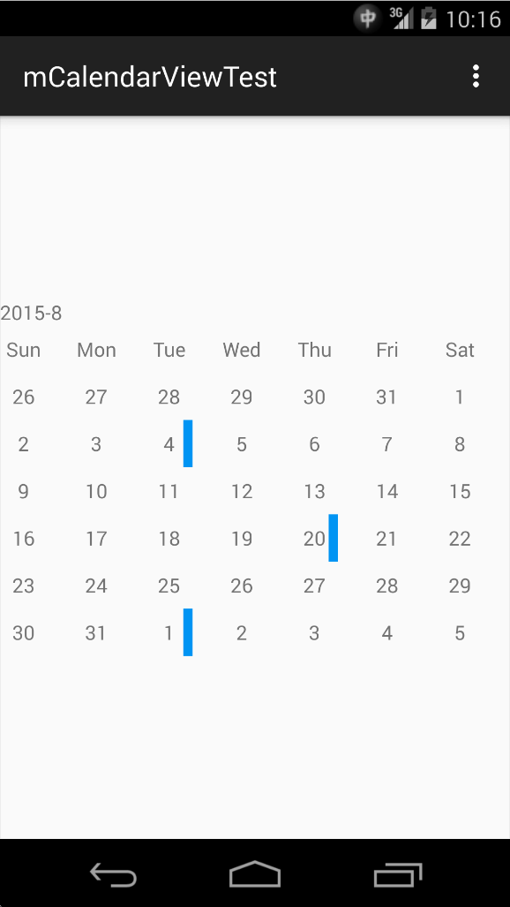

# mCalendarView

Customizable & Expandable Calendar Widget for Android

##Project Components
mCalendarView provide below components.

* mCalendarView, which is our customizable calendar widget.
* ExpCalendarView, which is expandable calendar widget.
* BaseCellView, an abstract view class for date cells.
* BaseMarkView, an abstract view class for marked / highlighted date cells.
* MarkStyle, provide built-in and default mark / highlight style values.
* DefaultCellView, default view for date cells.
* DefaultMarkView, dafault view for mark / highlight cells.
* OnDateClickListener, which will be triggered when date cell is clicked.
* OnMonthChangeListener, which will be triggered when changing month by sliding left / right.

## Project Structure
After checkout this repo, you will get a sample project and the mCalendarView module is located in `mcalendarview` folder.

Class `mCalednarView` is for normal calendar view.

Class `ExpCalendarView` is for expandable calendar view.

Expandable calendar view is contributed by my homie [mBigMing](https://github.com/mBigFlower). Big thank you for that.

##Screenshots
I used Android built-in `screenrecord` command to get the screenshot. But for some reason I don't know, the screen color is weird...

##Usage

###Add to Layout
To use mCalendarView, you need to add it in layout by using xml file or Java code. 

####Add normal calendarview

######Make sure you specifiy an `FragmentActivity` or it's sub-class as mCalendarView's context.

	    <sun.bob.mcalendarview.mCalendarView
        android:layout_width="400dp"
        android:layout_height="400dp"
        tools:context=".MainActivity"
        android:id="@+id/calendar"
        />
        
####Add expandable calendarview

    <sun.bob.mcalendarview.views.ExpCalendarView
        android:id="@+id/calendar_exp"
        android:layout_width="match_parent"
        android:layout_height="wrap_content"
        tools:context=".MainActivity" />
        
###Jump to Date
By default, mCalendarView will display current month. If you what to jump to another month, use `travelTo(DateData date)` function in mCalendarView.

	mCalendarView calendarView = ((mCalendarView) findViewById(R.id.calendar));
	calendarView.travelTo(new DateData(1992, 5, 5));
	
###Mark / Highlight a Date
Android's built-in widget dosen't have this feature, that's why I'm writing this widget.

There are two method in mCalendarViewClass to highlight a date.
	
* markDate(int year, int month, int day);
* markDate(DateData date); 
	
To mark / highlight a date, use one of those two functions in mCalendarView.

Below function will hightlight a date with default / global color and style.

	mCalendarView calendarView = ((mCalendarView) findViewById(R.id.calendar));
	calendarView.markDate(2015, 10, 7);
	
Below function will let you specify a customized hightlight style and color.

	mCalendarView calendarView = ((mCalendarView) findViewById(R.id.calendar));
	calendarView.markDate(
		new DateData(2016, 3, 1).setMarkStyle(new MarkStyle(MarkStyle.DOT, Color.GREEN)
	);
	
###Use built-in Mark Styles

mCalendarView provide below built-in mark styles. Mark styles are defined in class `MarkStyle`.

* Change Background Color. 
		
		MarkStyle.BACKGROUND
* Add a dot under date text.

		MarkStyle.DOT
* Add a colored vertical bar on the left side of date text.

		MarkStyle.LEFTSIDEBAR
* Add a colored vertical bar on the right side of date text.

		MarkStyle.RIGHTSIDEBAR
		
To specify the default / global highlight style, use `setMarkedStyle(int style)` function in mCalendarView.

	mCalendarView calendarView = ((mCalendarView) findViewById(R.id.calendar));
	calendarView.setMarkedStyle(MarkStyle.BACKGROUND);
	
Default highlight style is change background color.

To specify the default / global highlight style and color, use `setMarkedStyle(int style, int color)` function in mCalendarView.

To specify a highlight style and color for one day, use `setMarkStyle(MarkStyle markStyle)` function in DateData.

You can get screenshots of each mark styles in `More ScreenShots` Section

###Use Customize Date Cell
mCalendarView allows you using your own views for date cells, but there are some restrictions.

* Your customized view must extend `BaseCellView`, which inherit from `LinearLayout`.

* Your customized view must implement `setDisplayText`. This function will be called when mCalendarView need to display something in the cell. Usually it's date number or day of week ('Sun', 'Mon'...'Sat').
		
		public class DateCellView extends BaseCellView {
		    public DateCellView(Context context) {
		        super(context);
		    }
		
		    public DateCellView(Context context, AttributeSet attrs) {
		        super(context, attrs);
		    }
		
		    @Override
		    public void setDisplayText(String text) {
		        ((TextView) this.findViewById(R.id.id_cell_text)).setText(text);
		    }
		}
* Create a layout xml in your project which root node is your customized view. For example, I created a `layout_date_cell.xml` in the sample project.

		<?xml version="1.0" encoding="utf-8"?>
		<sun.bob.mcalendarviewtest.DateCellView 
			xmlns:android="http://schemas.android.com/apk/res/android"
		    android:orientation="vertical"
		    android:layout_width="100dp"
		    android:layout_height="100dp"
		    android:background="#00ADA3">
		    <TextView
		        android:layout_width="match_parent"
		        android:layout_height="match_parent"
		        android:textColor="#FFFFFF"
		        android:id="@+id/id_cell_text"/>
		</sun.bob.mcalendarviewtest.DateCellView>
* Build your view and pass its id to mCalendarView by calling `setDateCell(int dateCellResId)`.

		mCalendarView calendarView = ((mCalendarView) findViewById(R.id.calendar));
		calendarView.setDateCell(R.layout.layout_date_cell)
		
###Use Customized Mark Cell
mCalendar allows you using your own views for marked / highlighted date cells.

To use this feature, your view need to extend `BaseMarkView`.

The rest parts are the same with `Use Customized Date Cell`.

###Set OnMonthChangeListener
`OnMonthChangeListener` is an abstract class and will be invoked when user sliding right or left to change month. It will provide value of current year and month as parameter.

	public abstract void onMonthChange(int year, int month);

To set an OnMonthChangeListener, extend this class and call `setOnMonthChangeListener(OnMonthChangeListener l)` function in mCalendarView.

	calendarView.setOnMonthChangeListener(new OnMonthChangeListener() {
            @Override
            public void onMonthChange(int year, int month) {
                Toast.makeText(MainActivity.this, String.format("%d-%d", year, month), Toast.LENGTH_SHORT).show();
            }
        });
        
###Set OnDateClickListener
`OnDateClickListener` is an abstract class and will be invoked when use click on date cells. It will provide a `DateData` as parameter.

	public abstract void onDateClick(View view,DateData date);

To set an OnDateClickListener, extend this class and call `setOnDateClickListener(OnDateClickListener l)` function in mCalendarView.

	calendarView.setOnDateClickListener(new OnDateClickListener() {
            @Override
            public void onDateClick(View view, DateData date) {
                Toast.makeText(MainActivity.this, String.format("%d-%d", date.getMonth(), date.getDay()), Toast.LENGTH_SHORT).show();
            }
        });
        
###Expand & Shrink

	expCalendarView.expand();
	expCalendarView.shrink();
        
#More Screenshots
####MarkStyle.BACKGROUND

####MarkStyle.DOT

####MarkStyle.LEFTSIDEBAR

####MarkStyle.RIGHTSIDEBAR

#Credits

###[mBigMing](https://github.com/mBigFlower)

For Expandabel calendar view.

###[oong](https://github.com/oong) & [Barry](https://github.com/fg2q1q3q)

For bug fix.

###[Rodrigo Arantes](https://github.com/rodriggoarantes)

For WeekColumnView Translate in ExpCalendarView.

#License
Copyright 2015 Bob Sun

Licensed under the Apache License, Version 2.0 (the "License"); you may not use this file except in compliance with the License. You may obtain a copy of the License at

http://www.apache.org/licenses/LICENSE-2.0
Unless required by applicable law or agreed to in writing, software distributed under the License is distributed on an "AS IS" BASIS, WITHOUT WARRANTIES OR CONDITIONS OF ANY KIND, either express or implied. See the License for the specific language governing permissions and limitations under the License.

See LICENSE file for details.